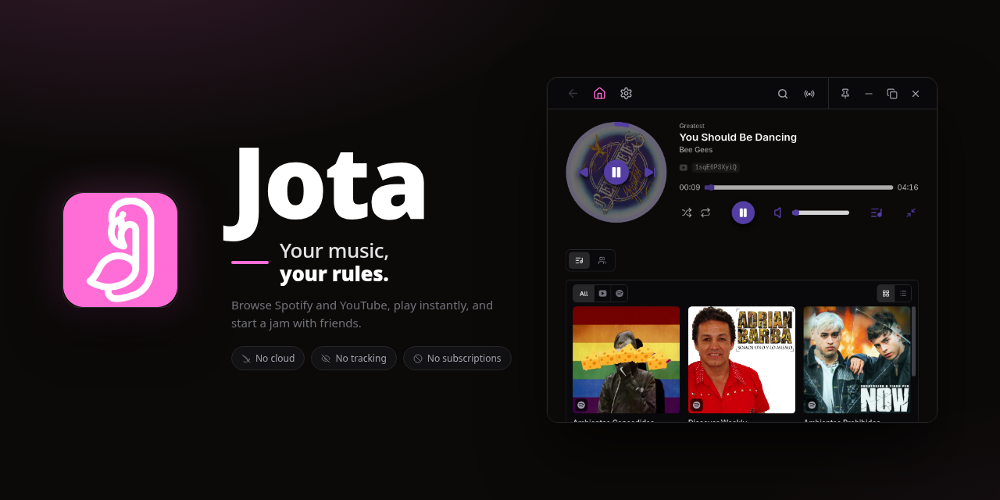
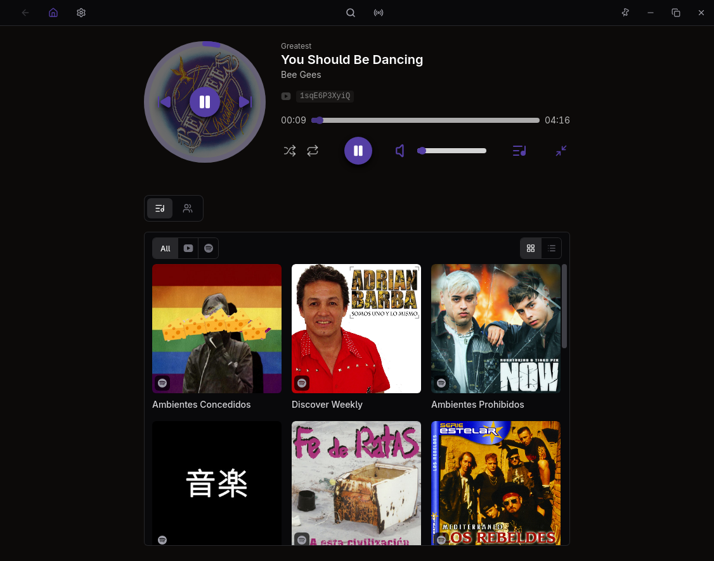
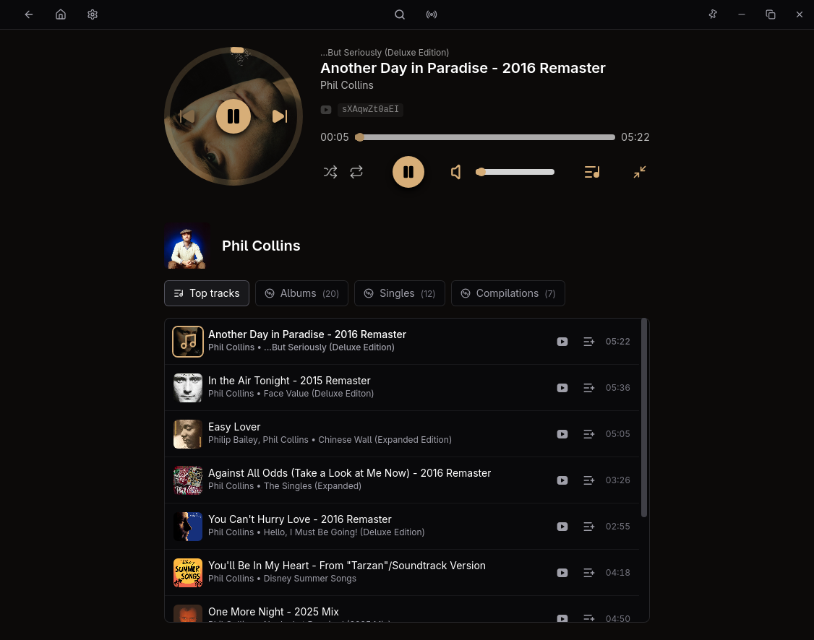
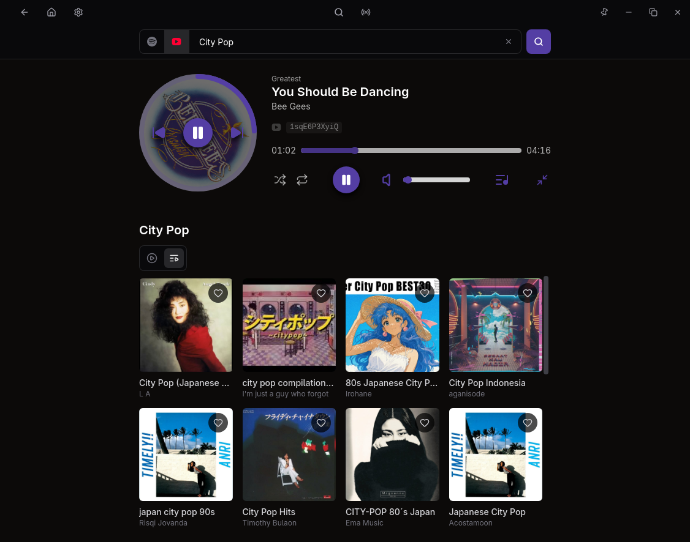

# Jota

<p align="center">
  
</p>

> Your music, your rules.

Developed by [salvadorsru](https://github.com/salvadorsru) — a hobby project,
not affiliated with Spotify, Google or any music label.

A self-hosted music streaming app for desktop and mobile. Browse Spotify, play
the audio through YouTube, and start a jam over a relay you own.

**No cloud. No tracking. No subscriptions.**

[](https://github.com/Jota-Music/jota/actions/workflows/ci.yml)
[](LICENSE)
[](go.mod)

## Features

- **Two sources, one player.** Browse Spotify and YouTube side by side and
  play either from the same queue and search bar. Spotify is optional — the
  YouTube side works standalone.
- **Browse Spotify.** Log in to browse playlists, albums, artists, tracks and
  other users' public playlists, with search across all of them.
- **YouTube first-class.** Search videos and playlists, save them to your home
  shelf, or paste a link to jump straight in. Tracks resolve to a YouTube
  stream at play time by saved ID or title/artist match — fix a wrong match by
  hand.
- **Full player.** Play/pause, seek, volume, shuffle and repeat, plus a queue
  you can add to, reorder and prune. Upcoming tracks preload so playback stays
  smooth.
- **Native media controls.** Media keys, lock-screen and notification controls
  work on desktop and mobile.
- **Jams.** Sync queue, play/pause, position, shuffle and repeat across
  devices over your own WebSocket relay
  ([`Jota-Music/relay`](https://github.com/Jota-Music/relay)).
- **Cross-platform.** Built with Wails 3 — native desktop on Linux, Windows
  and macOS, plus Android, from one codebase.
- **Private by default.** Data stays local. No accounts, no telemetry, no
  third-party servers.

## Screenshots

<p align="center">
  
</p>

<p align="center">
  
</p>

<p align="center">
  
</p>

## Get started

Requirements: Go 1.26+, Bun and `wails3`; on Linux also `webkit2gtk-4.1` and
`gtk+-3.0`. Android builds need JDK ≤ 24, macOS needs Xcode CLT.

```bash
WEBKIT_DISABLE_DMABUF_RENDERER=1 wails3 dev    # live reload (vite on :9245)
wails3 task build                              # binary → bin/jota
wails3 task package                            # .deb + .rpm + archlinux → bin/
```

## Download

Tagged releases ship:

| Platform | Artifacts |
|----------|-----------|
| Linux | `.deb`, `.rpm`, `.AppImage`, `.flatpak`, `PKGBUILD` `(AUR)` |
| Android | `.apk` |
| Windows | NSIS `.exe` |
| macOS | universal `.dmg` |

> [!WARNING]
> The Windows `.exe` and macOS `.dmg` are unsigned and may be flagged or blocked
> by SmartScreen and Gatekeeper.

## Roadmap

- **Internal playlists** — search and create local playlists without depending
  on Spotify or YouTube.
- **More sources** beyond Spotify and YouTube.

## Disclaimer

Jota interfaces with Spotify's public OAuth API and YouTube's undocumented
innertube API for audio. It does not bypass Spotify's access controls; YouTube
usage is not endorsed by Google and may violate their Terms of Service — you
are responsible for complying with applicable laws and platform policies. No
content is distributed, cached or monetized: everything is fetched at runtime
and belongs to its respective rights holders.

## License

[GPL-3.0](LICENSE) · Copyright (C) 2026 salvadorsru